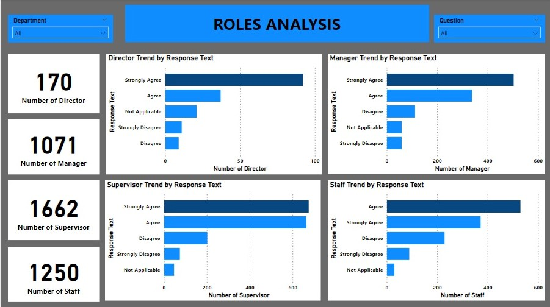

# Employee-Survey-Analysis

## Overview

This dataset contains responses by government employees engagement survey conducted by Pierce County WA. It contains a single table, 10 columns and 14,725 records. This project is analyzed to derive findings, trends and insight which will help increase employee satisfaction.

## Analysis Tool
Power BI.

## Category 
HR Analysis.

## Problem Statement

1. Which survey questions did respondents agree with or disagree with most? 
2. Do you see any patterns or trends by department or role? 
3. As an employer, what steps might you take to improve employee satisfaction based on the survey results?

## Skills/Concepts demonstrated

The following Power BI features were incorporated:
- Data cleaning,
- New measures,
- Slicers,
- Filters.

## Modeling
No modeling was derived because it is a single tabled dataset. 

## Visualization

The report comprises of 6 pages:
1. Title,
2. Overview,
3. Questions Analysis,
4. Department Analysis,
5. Role Analysis,
6. Findings & Recommendations.

## Analysis

### Questions Analysis

There were a total of 10 questions and 14,725 responses. The top five questions which respondents agree with mostly are questions 1, 4, 9, 2, & 5. The top five questions which respondents disagreed with mostly were questions 6, 3, 8, 10, & 7.
N/B: The total agree count was derived by adding the agree count and the strongly agree count, the same was done for the total disagree count.

### Department analysis

A departmental analysis was conducted to find trends and insights. There were a total of 21 departments that participated in this survey. The department with the highest response to questions was the Planning and Public works with 4.5k(31.95%). It was also the department with the highest agree count(3600) with question 1 being the most agreed question for the department. The Planning and Public works department also had the highest disagree count with question 6 being the most disagreed question.
N/B: This could be because that department had the highest number of respondents. An assumption will be that it is the department with the highest employee number.

### Roles Analysis

A role analysis was conducted to find insights and trends in the various roles. There were a total of 4 roles. The Supervisor role had the highest number of respondents.
N/B: Based on the table chart analysis on page 3, I noticed a disparity in the total number of respondents by roles and the number of respondents. This could be that most respondents didn't indicate their roles in the survey.

## RECOMMENDATION

Having the total number of employees in each department would be vital for the next survey analysis as this will better help in determining the level of involvement and satisfaction from the survey.
Based on my findings, to ensure employee satisfaction as an employer I will make sure to organize employee events to encourage interaction and bonding between employees and build better relationships across all departments.

